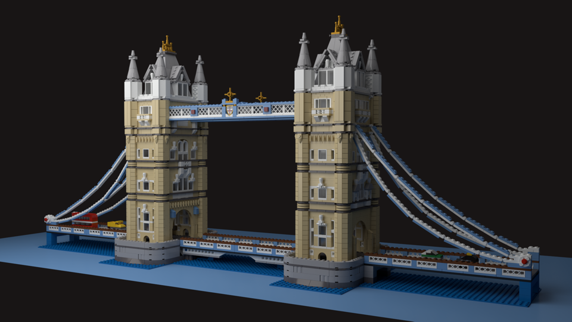
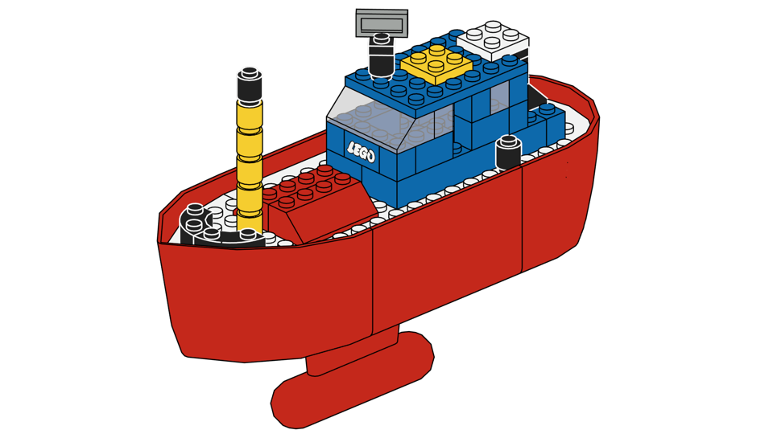
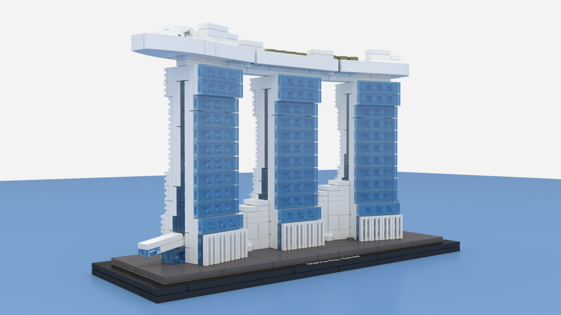
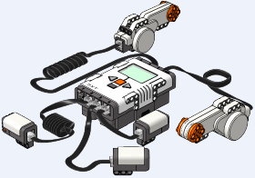

# Import LDraw #

> A [Blender](https://www.blender.org)&trade; plug-in for importing [LDraw](http://www.ldraw.org)&trade; file format models and parts.

## Purpose ##
*Import LDraw* imports [LEGO](https://www.lego.com/)® models into Blender.

It supports **.mpd**, **.ldr**, **.l3b**, and **.dat** file formats.

It's intended to be accurate, compatible, and fast (in that order of priority).

## Features ##
+ Available for both Blender 2.79 and Blender 2.81
+ **Mac** and **Windows** supported (and hopefully **Linux**, but this is currently untested).
+ **Bricksmith** compatible.
+ **MPD** file compatible.
+ **LeoCAD** groups and cameras (both perspective and orthographic) supported.
+ **LSynth** bendable parts supported (synthesized models).
+ *Cycles* and *Blender Render* engines supported. It renders either engine from a single scene.
+ Import **photorealistic** look, or **Instructions** look.
+ **Physically Based Realistic materials** - standard brick material, transparent, rubber, chrome, metal, pearlescent, glow-in-the-dark, glitter and speckle.
+ **Principled Shader supported** Uses Blender's 'Principled Shader' where available for optimal look (but still works well when unavailable).
+ **Accurate colour handling**. Correct colour space management is used so that e.g. black parts look black.
+ **Direct colours** supported.
+ **Back face culling** - fully parses all BFC information, for accurate normals.
+ **Linked duplicates** - Parts of the same type and colour can share the same mesh.
+ **Linked studs** - studs can also share the same mesh.
+ Studs can include the **LEGO logo** on them, adding extra geometry.
+ **Gaps between bricks** - Optionally adds a small space between each brick, as in real life.
+ **Smart face smoothing** - Uses Edge-Split Modifier and Sharp Edges derived from Ldraw lines, for smooth curved surfaces and sharp corners.
+ **Concave walls** - Optionally look as if each brick has very slightly concave walls (with the photorealistic renderer), which affects the look of light reflections.
+ **Light bricks** - Bricks that emit light are supported.
+ **Fast** - even large models can be imported in seconds.

## Installation and usage ##

**Installing the add-in**

+ Download the latest version from the [Releases](https://github.com/TobyLobster/ImportLDraw/releases) page
+ Open Blender
+ If you are in Blender 2.79 or lower, choose from the menu: File > User Preferences
+ If you are in Blender 2.80 or later, choose from the menu: Edit > Preferences
+ Click the *Add-ons* tab
+ Click the *Install from file...* button (Blender 2.79) or *Install...* button (Blender 2.81)
+ Navigate to the zip file you downloaded and select it
+ Find *Import LDraw* in the list of Add-ons (search for *LDraw* if necessary)
+ Tick the check mark next to it to activate the add-on.
+ Click the *Save User Settings* button (Blender 2.79) or *Save Preferences* button (Blender 2.81) so that it will still be active next time you launch Blender.

**Setting the LDraw Parts Library directory**

+ Download the latest complete [LDraw Parts Library](http://ldraw.org/parts/latest-parts.html) and unzip it to a directory e.g. called 'ldraw'.
+ OPTIONAL: Download the unofficial parts and unzip it to sub-directory 'ldraw/unofficial/'
+ From the Blender menu click: File > Import > LDraw (.mpd/.ldr/.l3b/.dat).
+ In the bottom left of Blender's window, there's a panel of *Import Options*.
+ The first option is the LDraw Parts Library directory. Type the full filepath to the 'ldraw' directory you unzipped to.
+ To save that directory and try it out, choose a file to import.

## History ##
This plug-in is by Toby Nelson (tobymnelson@gmail.com) and was initially written in May 2016.

It was inspired by and initially based on code from [LDR-Importer](https://github.com/le717/LDR-Importer) but has since been completely rewritten.

## License ##

*Import LDraw* is licensed under the [GPLv2](http://www.gnu.org/licenses/gpl-2.0.html) or any later version.

## Thanks ##
Thanks to [BertVanRaemdonck](https://github.com/BertVanRaemdonck) for the 'concave walls' feature, and for the useful feedback and suggestions.

## External References ##

**Blender**&trade; is the free and open source 3D creation suite. 

**LDraw**&trade; is an open standard for LEGO CAD programs that allow the user to create virtual LEGO models and scenes. You can use it to document models you have physically built, create building instructions just like LEGO, render 3D photo realistic images of your virtual models and even make animations.
The possibilities are endless. Unlike real LEGO bricks where you are limited by the number of parts and colors, in LDraw nothing is impossible.

LDraw&trade; is a trademark owned and licensed by the Estate of James Jessiman. This plug-in is not developed or endorsed by the creators of The LDraw System of Tools. 

**Bricksmith** allows you to create virtual instructions for your Lego creations on your Mac. 

**LSynth** is a program that synthesizes bendable parts for LDraw files. 

**LEGO**® is a registered trademark of the Lego Group 
