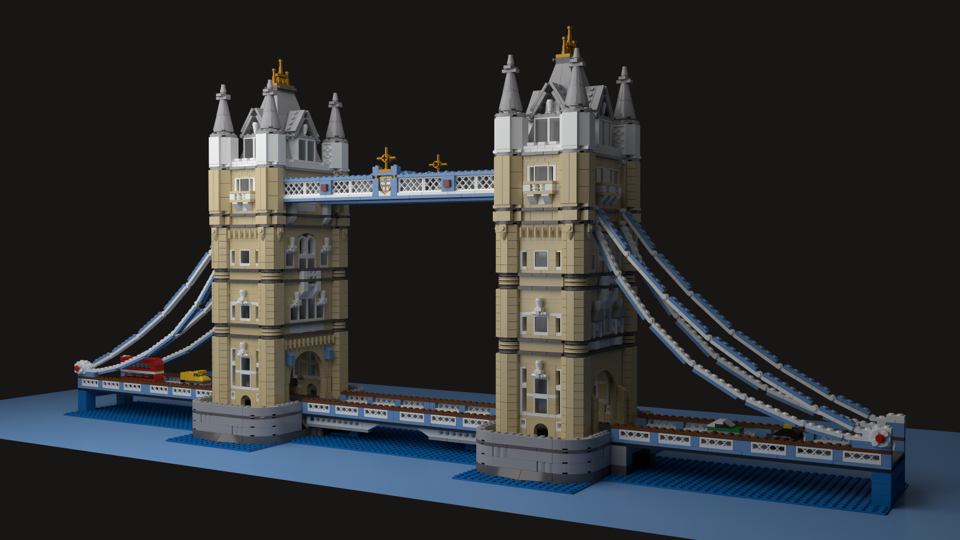
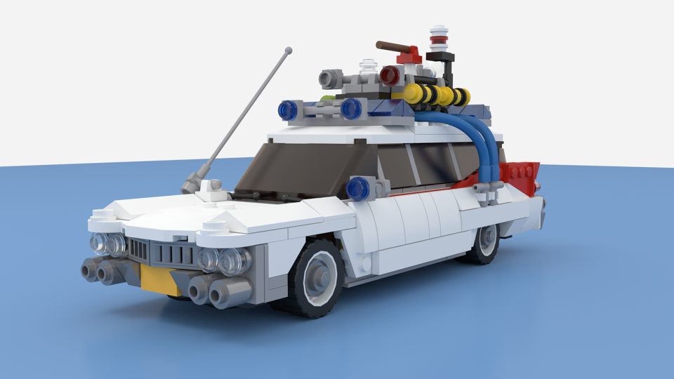
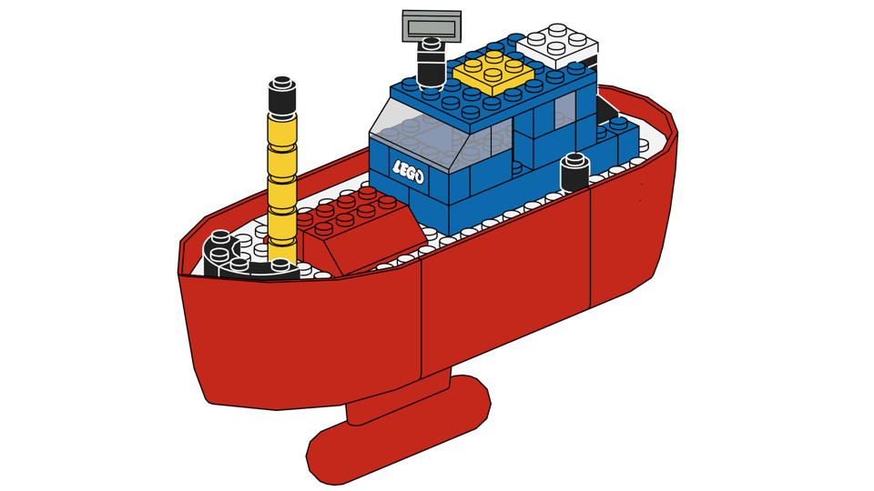
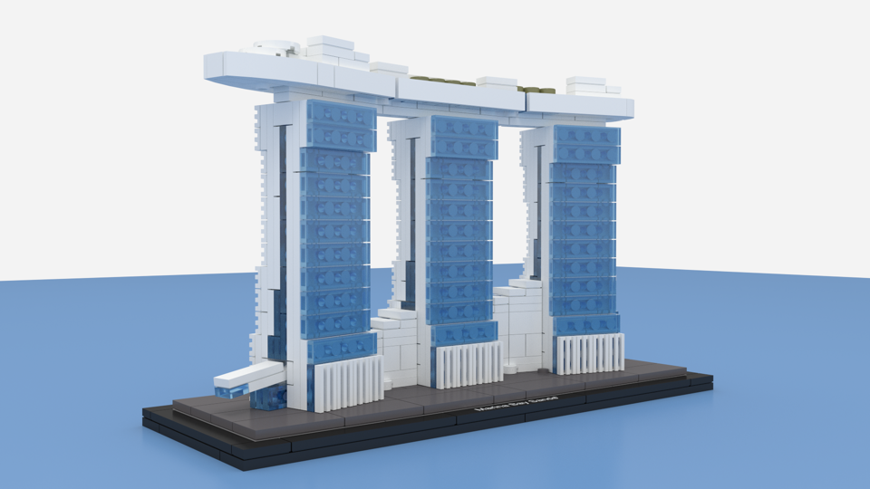
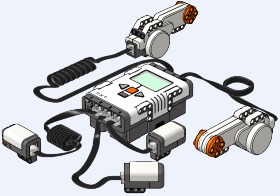

# Import LDraw #

> A [Blender](https://www.blender.org)&trade; plug-in for importing [LDraw](http://www.ldraw.org)&trade; file format models and parts.

## Purpose ##
*Import LDraw* imports [LEGO](https://www.lego.com/)® models into Blender.

It supports **.mpd**, **.ldr**, **.l3b**, and **.dat** file formats.

It's intended to be accurate, compatible, and fast (in that order of priority).

## Features ##
+ Works with Blender 4.0 up to at least Blender 5.1.0 (for Blender 2.81 to 3.6, use version 1.2.3 from the [Releases](https://github.com/TobyLobster/ImportLDraw/releases) page)
+ **Mac**, **Windows** and **Linux** supported.
+ **Bricksmith** compatible.
+ **MPD** file compatible.
+ **LeoCAD** groups and cameras (both perspective and orthographic) supported.
+ **LSynth** bendable parts supported (synthesized models).
+ *Cycles* (realistic look) and *EEVEE* (instructions look) render engines supported.
+ Import **photorealistic** look, or **Instructions** look.
+ **Physically Based Realistic materials** - standard brick material, transparent, rubber, chrome, metal, pearlescent, glow-in-the-dark, glitter, speckle and fabric (cape cloth, canvas, velvet, string and fur, for capes, sails and other cloth parts).
+ **Principled Shader** - Uses Blender's Principled BSDF shader for an optimal look.
+ **Textures** - printed parts and stickers that use the LDraw texture mapping extension (!TEXMAP: planar, cylindrical and spherical) import with their images. Images are found in the *textures* folders of the parts library, or can be embedded in the model file (!DATA). Embedded images are packed into the .blend file, or optionally saved next to the model. Untick *Import textures* to import the untextured versions instead.
+ **Accurate colour handling**. Correct colour space management is used so that e.g. black parts look black.
+ **Direct colours** supported.
+ **Colours defined in models** - colour definitions (!COLOUR) inside a model or part file are used, following the LDraw rules: from where a colour is defined to the end of that file, and in the submodels and parts it uses after that.
+ **Back face culling** - fully parses all BFC information, for accurate normals.
+ **Linked duplicates** - Parts of the same type and colour can share the same mesh.
+ **Linked studs** - studs can also share the same mesh.
+ Studs can include the **LEGO logo** on them, adding extra geometry.
+ **Gaps between bricks** - Optionally adds a small space between each brick, as in real life.
+ **Smart face smoothing** - Uses Edge-Split Modifier and Sharp Edges derived from Ldraw lines, for smooth curved surfaces and sharp corners.
+ **Rounded edges** - Optionally bevels the edges of each part, each edge as wide as fits, so detailed parts round off cleanly. By default the bevels are baked into each part's shared mesh, which uses far less memory for big models; untick *Bake bevels* to keep them as Bevel modifiers you can adjust after import.
+ **Concave walls** - Optionally look as if each brick has very slightly concave walls (with the photorealistic renderer), which affects the look of light reflections.
+ **Light bricks** - Bricks that emit light are supported.
+ **Studio lighting** - The realistic look is lit by an HDR image of a studio (*background.exr*). If the image is missing, a similar built-in studio light is used instead.
+ **Parenting Minifigs** - Optionally make the parts of a minifig parented to each other, so e.g. rotating an arm also moves the hand with it.
+ **Building steps** - Each part records the building step it is added in (*0 STEP* and *0 ROTSTEP* lines). Optionally the import animates building the model: each step's parts appear in turn (a submodel appears all at once, in the step that uses it), with a timeline marker for each step. Pieces LeoCAD hides from a later step disappear then.
+ **Submodels as collections** - Optionally give each submodel its own collection, nested like the submodels, so whole submodels can be shown or hidden, or used with geometry nodes.
+ **Fast** - even large models can be imported in seconds.

## Installation and usage ##

**Installing the add-in**

+ Download the latest version from the [Releases](https://github.com/TobyLobster/ImportLDraw/releases) page
+ Open Blender
+ Choose from the menu: Edit > Preferences
+ Click the *Add-ons* tab

Blender 4.0 and 4.1:
+ Click the *Install...* button
+ Navigate to the zip file you downloaded and select it
+ Find *Import LDraw* in the list of Add-ons (search for *LDraw* if necessary)
+ Tick the check mark next to it to activate the add-on.
+ Click the *Save Preferences* button so that it will still be active next time you launch Blender.

Blender 4.2 and above:
+ From the down arrow at the top right, choose *Install from Disk...*
+ Navigate to the zip file you downloaded and select it
+ Find *Import LDraw* in the list of Add-ons (search for *LDraw* if necessary)
+ Tick the check mark next to it to activate the add-on.
+ From the three horizontal lines button in the bottom left, choose *Save Preferences*.

**Setting the LDraw Parts Library directory**

+ Download the latest complete [LDraw Parts Library](https://library.ldraw.org/updates?latest) and unzip it to a directory e.g. called 'ldraw'.
+ (Or leave it zipped: *Import LDraw* can read the parts straight from the downloaded *complete.zip*. Use the folder containing *complete.zip* as the LDraw Parts Library directory, or the path of the zip file itself.)
+ (Note there currently seems to be an issue if the path to the ldraw directory contains spaces, so avoid using spaces in the full path to the ldraw directory.).
+ OPTIONAL: Download the unofficial parts and unzip it to sub-directory 'ldraw/unofficial/' (or put the zipped *ldrawunf.zip* in the 'ldraw' directory, or next to *complete.zip*)
+ From the Blender menu click: File > Import > LDraw (.mpd/.ldr/.l3b/.dat).
+ (Or, in Blender 4.1 and above, drag an LDraw file from Finder or File Explorer onto the 3D Viewport. The import options appear in a pop-up.)
+ In the bottom left of Blender's window, there's a panel of *Import Options*.
+ The first option is the LDraw Parts Library directory. Type the full filepath to the 'ldraw' directory you unzipped to.
+ To save that directory and try it out, choose a file to import.

## History ##
This plug-in is by Toby Nelson (tobymnelson@gmail.com) and was initially written in May 2016.

It was inspired by and initially based on code from [LDR-Importer](https://github.com/le717/LDR-Importer) but has since been completely rewritten.

## License ##

*Import LDraw* is licensed under the [GPLv2](http://www.gnu.org/licenses/gpl-2.0.html) or any later version.

## Thanks ##
Thanks to [BertVanRaemdonck](https://github.com/BertVanRaemdonck) for the 'concave walls' feature, and for the useful feedback and suggestions.

## External References ##

**Blender**&trade; is the free and open source 3D creation suite. 

**LDraw**&trade; is an open standard for LEGO CAD programs that allow the user to create virtual LEGO models and scenes. You can use it to document models you have physically built, create building instructions just like LEGO, render 3D photo realistic images of your virtual models and even make animations.
The possibilities are endless. Unlike real LEGO bricks where you are limited by the number of parts and colors, in LDraw nothing is impossible.

LDraw&trade; is a trademark owned and licensed by the Estate of James Jessiman. This plug-in is not developed or endorsed by the creators of The LDraw System of Tools. 

**Bricksmith** allows you to create virtual instructions for your Lego creations on your Mac. 

**LSynth** is a program that synthesizes bendable parts for LDraw files. 

**LEGO**® is a registered trademark of the Lego Group 
